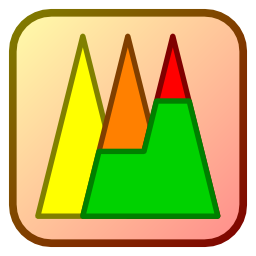

<div align="center">
<a href="https://github.com/fuzzylite/fuzzylite"></a>
<h1>fuzzylite 7.0.0</h1>
<h2>A Fuzzy Logic Control Library in C++</h2>

by <a href="https://fuzzylite.com/about"><b>Juan Rada-Vilela, PhD</b></a>

[](https://opensource.org/license/gpl-3-0/)
[](mailto:sales@fuzzylite.com)

[](https://github.com/fuzzylite/fuzzylite/actions/workflows/main-linux.yml)
[](https://github.com/fuzzylite/fuzzylite/actions/workflows/main-macos.yml)
[](https://github.com/fuzzylite/fuzzylite/actions/workflows/main-windows.yml)

[](https://github.com/fuzzylite/fuzzylite/actions/workflows/monthly-linux.yml)
[](https://github.com/fuzzylite/fuzzylite/actions/workflows/monthly-macos.yml)
[](https://github.com/fuzzylite/fuzzylite/actions/workflows/monthly-windows.yml)

[](
https://coveralls.io/github/fuzzylite/fuzzylite?branch=main)

</div>

## <a name="fuzzylite">FuzzyLite</a>

**The FuzzyLite Libraries for Fuzzy Logic Control** refer to [`fuzzylite`](https://github.com/fuzzylite/fuzzylite/)
(C++), [`pyfuzzylite`](https://github.com/fuzzylite/pyfuzzylite/) (Python),
and [`jfuzzylite`](https://github.com/fuzzylite/jfuzzylite/) (Java).

The **goal** of the FuzzyLite Libraries is to **easily** design and **efficiently** operate fuzzy logic controllers
following an **object-oriented** programming model with minimal dependency on external libraries.

## <a name="license">License</a>

`fuzzylite` is dual-licensed under the [**GNU GPL 3.0**](https://opensource.org/license/gpl-3-0/) and under a
**proprietary license for commercial purposes**.

You are **strongly** encouraged to support the development of the FuzzyLite Libraries by purchasing a license
of [`QtFuzzyLite`](https://fuzzylite.com/downloads).

[`QtFuzzyLite`](https://fuzzylite.com/downloads/) is the best graphical user interface available to easily design and
directly operate fuzzy logic controllers in real time. Available for Windows, Mac, and Linux, its goal is to
significantly **speed up** the design of your fuzzy logic controllers, while providing a very **useful**, **functional**
and **beautiful** user interface.
Please, download it and check it out for free at [fuzzylite.com/downloads](https://fuzzylite.com/downloads).

## <a name="documentation">Documentation</a>

Visit [**fuzzylite.com/documentation**](https://fuzzylite.com/documentation)

## <a name="features">Features</a>

**(6) Controllers**: Mamdani, Takagi-Sugeno, Larsen, Tsukamoto, Inverse Tsukamoto, Hybrid

**(25) Linguistic terms**:  (5) *Basic*: Triangle, Trapezoid, Rectangle, Discrete, SemiEllipse.
(8) *Extended*: Bell, Cosine, Gaussian, GaussianProduct, PiShape, SigmoidDifference, SigmoidProduct, Spike.
(7) *Edges*: Arc, Binary, Concave, Ramp, Sigmoid, SShape, ZShape.
(3) *Functions*: Constant, Linear, Function. (2) *Special*: Aggregated, Activated.

**(7) Activation methods**:  General, Proportional, Threshold, First, Last, Lowest, Highest.

**(9) Conjunction and Implication (T-Norms)**: Minimum, AlgebraicProduct, BoundedDifference, DrasticProduct,
EinsteinProduct, HamacherProduct, NilpotentMinimum, LambdaNorm, FunctionNorm.

**(11) Disjunction and Aggregation (S-Norms)**:  Maximum, AlgebraicSum, BoundedSum, DrasticSum, EinsteinSum,
HamacherSum, NilpotentMaximum, NormalizedSum, UnboundedSum, LambdaNorm, FunctionNorm.

**(7) Defuzzifiers**:  (5) *Integral*: Centroid, Bisector, SmallestOfMaximum, LargestOfMaximum, MeanOfMaximum.
(2) *Weighted*: WeightedAverage, WeightedSum.

**(7) Hedges**: Any, Not, Extremely, Seldom, Somewhat, Very, Function.

**(3) Importers**: FuzzyLite Language `fll`, Fuzzy Inference System `fis`, Fuzzy Control Language `fcl`.

**(7) Exporters**: `C++`, `Java`, FuzzyLite Language `fll`, FuzzyLite Dataset `fld`, `R` script, Fuzzy Inference
System `fis`, Fuzzy Control Language `fcl`.

**(30+) Examples**  of Mamdani, Takagi-Sugeno, Tsukamoto, and Hybrid controllers from `fuzzylite`, Octave, and Matlab,
each included in the following formats: `C++`, `Java`, `fll`, `fld`, `R`, `fis`, and `fcl`.

## <a name="example">Example</a>

### FuzzyLite Language

```yaml
#File: ObstacleAvoidance.fll
Engine: ObstacleAvoidance
InputVariable: obstacle
  enabled: true
  range: 0.000 1.000
  lock-range: false
  term: left Ramp 1.000 0.000
  term: right Ramp 0.000 1.000
OutputVariable: mSteer
  enabled: true
  range: 0.000 1.000
  lock-range: false
  aggregation: Maximum
  defuzzifier: Centroid 100
  default: nan
  lock-previous: false
  term: left Ramp 1.000 0.000
  term: right Ramp 0.000 1.000
RuleBlock: mamdani
  enabled: true
  conjunction: none
  disjunction: none
  implication: AlgebraicProduct
  activation: General
  rule: if obstacle is left then mSteer is right
  rule: if obstacle is right then mSteer is left
```

```cpp
//File: ObstacleAvoidance.cpp
#include <fl/Headers.h>

fl::Engine* engine = fl::FllImporter().fromFile("ObstacleAvoidance.fll");
```

#### C++

```cpp
//File: ObstacleAvoidance.cpp
#include <fl/Headers.h>

using namespace fuzzylite;

Engine* engine = new Engine;
engine->setName("ObstacleAvoidance");
engine->setDescription("");

InputVariable* obstacle = new InputVariable;
obstacle->setName("obstacle");
obstacle->setDescription("");
obstacle->setEnabled(true);
obstacle->setRange(0.000, 1.000);
obstacle->setLockValueInRange(false);
obstacle->addTerm(new Ramp("left", 1.000, 0.000));
obstacle->addTerm(new Ramp("right", 0.000, 1.000));
engine->addInputVariable(obstacle);

OutputVariable* mSteer = new OutputVariable;
mSteer->setName("mSteer");
mSteer->setDescription("");
mSteer->setEnabled(true);
mSteer->setRange(0.000, 1.000);
mSteer->setLockValueInRange(false);
mSteer->setAggregation(new Maximum);
mSteer->setDefuzzifier(new Centroid(100));
mSteer->setDefaultValue(fl::nan);
mSteer->setLockPreviousValue(false);
mSteer->addTerm(new Ramp("left", 1.000, 0.000));
mSteer->addTerm(new Ramp("right", 0.000, 1.000));
engine->addOutputVariable(mSteer);

RuleBlock* mamdani = new RuleBlock;
mamdani->setName("mamdani");
mamdani->setDescription("");
mamdani->setEnabled(true);
mamdani->setConjunction(fl::null);
mamdani->setDisjunction(fl::null);
mamdani->setImplication(new AlgebraicProduct);
mamdani->setActivation(new General);
mamdani->addRule(Rule::parse("if obstacle is left then mSteer is right", engine));
mamdani->addRule(Rule::parse("if obstacle is right then mSteer is left", engine));
engine->addRuleBlock(mamdani);
```

### <a name="operation">Operation</a>

```cpp
using namespace fuzzylite;

std::string status;
if (not engine->isReady(&status))
    throw Exception("[engine error] engine is not ready:\n" + status, FL_AT);

InputVariable* obstacle = engine->getInputVariable("obstacle");
OutputVariable* steer = engine->getOutputVariable("steer");

for (int i = 0; i <= 50; ++i){
    scalar location = obstacle->getMinimum() + i * (obstacle->range() / 50);
    obstacle->setValue(location);
    engine->process();
    FL_LOG("obstacle.input = " << Op::str(location) << 
        " => " << "steer.output = " << Op::str(steer->getValue()));
}
```

### <a name="compile-build-execute">Compile, Link, and Execute</a>

Once you have an engine written in C++, you can compile it to create an executable file which links to the `fuzzylite`
library. The linking can be either static or dynamic. Basically, the differences between static and dynamic linking are
the following.

**Static linking** includes the `fuzzylite` library into your executable file, hence increasing its size, but the
executable no longer needs to have access to the `fuzzylite` library files.

**Dynamic linking** does not include the `fuzzylite` library into your executable file, hence reducing its size, but the
executable needs to have access to the `fuzzylite` shared library file. When using dynamic linking, make sure that the
shared library files are either in the same directory as the executable, or are reachable via environmental variables:

```posh
rem Windows:
set PATH="\path\to\fuzzylite\release\bin;%PATH%"
```

```bash 
#Unix:
export LD_LIBRARY_PATH="/path/to/fuzzylite/release/bin/:$LD_LIBRARY_PATH"
```

#### Windows

The commands to compile your engine in Windows are the following:

C++11 (default)

```posh
rem static linking:
cl.exe ObstacleAvoidance.cpp fuzzylite-static.lib /Ipath/to/fuzzylite /EHsc /MD
```

```posh
rem dynamic linking:
cl.exe ObstacleAvoidance.cpp fuzzylite.lib /Ipath/to/fuzzylite /DFL_IMPORT_LIBRARY /EHsc /MD 
```

C++98

```posh
rem static linking:
cl.exe ObstacleAvoidance.cpp fuzzylite-static.lib /Ipath/to/fuzzylite /DFL_CPP98=ON /EHsc /MD
```

```posh
rem dynamic linking:
cl.exe ObstacleAvoidance.cpp fuzzylite.lib /Ipath/to/fuzzylite /DFL_IMPORT_LIBRARY /DFL_CPP98=ON /EHsc /MD 
```

#### Unix

The commands to compile your engine in Unix are the following:

C++11 (default)

```bash
#static linking
g++ ObstacleAvoidance.cpp -o ObstacleAvoidance -I/path/to/fuzzylite -L/path/to/fuzzylite/release/bin -lfuzzylite-static --std=c++11
```

```bash
#dynamic linking
g++ ObstacleAvoidance.cpp -o ObstacleAvoidance -I/path/to/fuzzylite -L/path/to/fuzzylite/release/bin -lfuzzylite
```

C++98

```bash
#static linking
g++ ObstacleAvoidance.cpp -o ObstacleAvoidance -I/path/to/fuzzylite -L/path/to/fuzzylite/release/bin -lfuzzylite-static -DFL_CPP98=ON
```

```bash
#dynamic linking
g++ ObstacleAvoidance.cpp -o ObstacleAvoidance -I/path/to/fuzzylite -L/path/to/fuzzylite/release/bin -lfuzzylite -DFL_CPP98=ON
```

## <a name="cmake">CMake</a>

Alternatively, you can use CMake to build your project linking to `fuzzylite`. Please, refer to the example application
available at [examples/application]([/examples/application]).

### <a name="building">Building  from Source</a>

You can build the `fuzzylite` library from source using  `CMake` [(cmake.org)](https://cmake.org/).

Check `.github/workflows` for details.

#### Unix

```bash
cmake -B build/ -G"Unix Makefiles"  .
cmake --build build/ --parallel
ctest --test-dir build/
```

#### Windows

```bash
cmake -B build/ -G"NMake Makefiles" .
cmake --build build/
ctest --test-dir build/
```

#### Building Options

The following building options available:

`-DFL_USE_FLOAT=ON` builds the binaries using the `fl::scalar` data type as a `float` instead of `double`. By default,
the binaries are built using `-DFL_USE_FLOAT=OFF`. If `fuzzylite` is built with `-DFL_USE_FLOAT=ON`, then the
applications linking to `fuzzylite` also need to specify this compilation flag.

`-DFL_CPP98=ON` builds binaries using `C++98` features instead of `C++11`. By default, the binaries are built
using `-DFL_CPP98=OFF`. If you use `C++98`, you will not be able to benchmark the performance of your engine using
the `Benchmark` class, and you will not be able to run any of the tests.

`-DFL_BACKTRACE=OFF` disables the backtrace information in case of errors. By default, the binaries are built
using `-DFL_BACKTRACE=ON`. In Windows, the backtrace information requires the external library `dbghelp`, which is
generally available in your system.

#### Documentation

The source code of `fuzzylite` is very well documented using [`doxygen`](www.doxygen.org/) formatting, and the
documentation is available at [fuzzylite.com/documentation](https://fuzzylite.com/documentation). If you want to
generate the documentation locally, you can produce the `html` documentation from the file [Doxyfile](/Doxyfile) using
the command line: `doxygen Doxyfile`. The documentation will be created in the [`docs`](/docs) folder.

### <a name="binaries">Binaries</a>

After building from source, the following are the relevant binaries that will be created in `Release` mode. In `Debug`
mode, the file names end with `-debug` (e.g., `fuzzylite-debug.exe`).

#### Windows

- console application: `fuzzylite.exe`
- shared library: `fuzzylite.dll`, `fuzzylite.lib`
- static library: `fuzzylite-static.lib`

#### Linux

- console application: `fuzzylite`
- shared library: `libfuzzylite.so`
- static library: `libfuzzylite-static.a`

#### Mac

- console application: `fuzzylite`
- shared library: `libfuzzylite.dylib`
- static library: `libfuzzylite-static.a`

#### Console

The console application of `fuzzylite` allows you to import and export your engines. Its usage can be obtained executing
the console binary. In addition, the console can be set in interactive mode. The `FuzzyLite Interactive Console`  allows
you to evaluate a given controller by manually providing the input values. The interactive console is triggered by
specifying an input file and an output format. For example, to interact with the `ObstacleAvoidance` controller, the
interactive console is launched as follows:

```bash
fuzzylite -i ObstacleAvoidance.fll -of fld
```

## <a name="contributing">Contributing</a>

All contributions are welcome, provided they follow the following guidelines:

- Source code is consistent with standards in the library
- Contribution is properly documented and tested, raising issues where appropriate
- Contribution is licensed under the FuzzyLite License

## <a name="reference">Reference</a>

If you are using the FuzzyLite Libraries, please cite the following reference in your article:

> Juan Rada-Vilela. The FuzzyLite Libraries for Fuzzy Logic Control, 2018. URL https://fuzzylite.com.

Or using `bibtex`:

```bibtex
@misc{fl::fuzzylite,
    author={Juan Rada-Vilela},
    title={The FuzzyLite Libraries for Fuzzy Logic Control},
    url={https://fuzzylite.com},
    year={2018}
}
```

***

fuzzylite&reg; is a registered trademark of FuzzyLite Limited <br>
jfuzzylite&trade; is a trademark of FuzzyLite Limited <br>
pyfuzzylite&trade; is a trademark of FuzzyLite Limited <br>
QtFuzzyLite&trade; is a trademark of FuzzyLite Limited <br>
