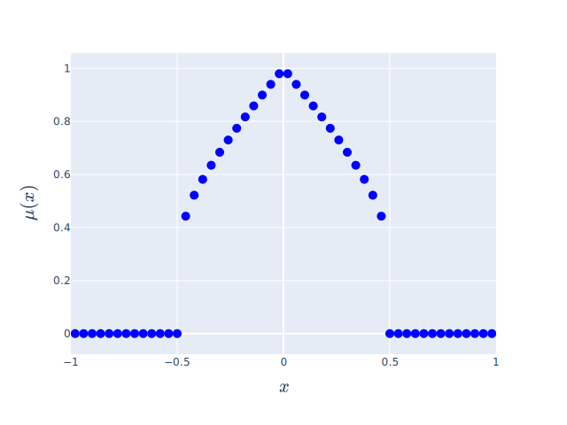
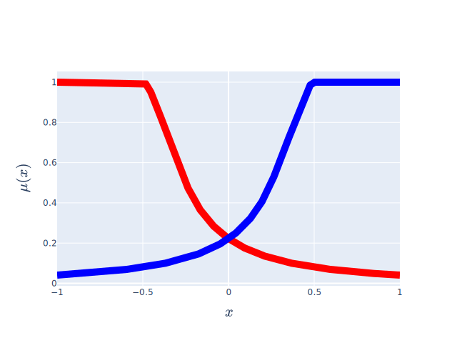
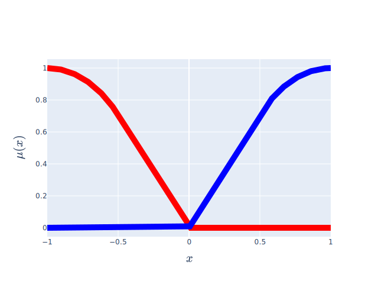

# Hedges
Hedges are used in the antecedent and consequent of a rule to modify the membership function of the term it precedes.

The hedges in the library can be ordered based on the difference between the
membership function $\mu(x)$ and its hedge $h(\mu(x))$ as follows (from most similar to least):
Seldom   $<$ Somewhat   $<$ Very  $<$ Extremely   $<$ Not   $<$ Any

| `term`                                                	| Seldom                                                                                                     	| Somewhat                                                                                                        	| Very                                                                                                    	| Extremely                                                                                                         	| Not                                                                                                   	| Any                                                                                                   	|
|-------------------------------------------------------	|------------------------------------------------------------------------------------------------------------	|-----------------------------------------------------------------------------------------------------------------	|---------------------------------------------------------------------------------------------------------	|-------------------------------------------------------------------------------------------------------------------	|-------------------------------------------------------------------------------------------------------	|-------------------------------------------------------------------------------------------------------	|
| [fuzzylite.term.Rectangle][]                          	| [fuzzylite.hedge.Seldom][] [fuzzylite.term.Rectangle][]                                                    	| [fuzzylite.hedge.Somewhat][] [fuzzylite.term.Rectangle][]                                                       	| [fuzzylite.hedge.Very][] [fuzzylite.term.Rectangle][]                                                   	| [fuzzylite.hedge.Extremely][] [fuzzylite.term.Rectangle][]                                                        	| [fuzzylite.hedge.Not][] [fuzzylite.term.Rectangle][]                                                  	| [fuzzylite.hedge.Any][] [fuzzylite.term.Rectangle][]                                                  	|
|                    	|                                                                 	|                                                                    	|                                                                	|                                                                     	|                                                               	|                                                               	|
| [fuzzylite.term.SemiEllipse][]                        	| [fuzzylite.hedge.Seldom][] [fuzzylite.term.SemiEllipse][]                                                  	| [fuzzylite.hedge.Somewhat][] [fuzzylite.term.SemiEllipse][]                                                     	| [fuzzylite.hedge.Very][] [fuzzylite.term.SemiEllipse][]                                                 	| [fuzzylite.hedge.Extremely][] [fuzzylite.term.SemiEllipse][]                                                      	| [fuzzylite.hedge.Not][] [fuzzylite.term.SemiEllipse][]                                                	| [fuzzylite.hedge.Any][] [fuzzylite.term.SemiEllipse][]                                                	|
|                 	|                                                              	|                                                                 	|                                                             	|                                                                  	|                                                            	|                                                            	|
| [fuzzylite.term.Triangle][]                           	| [fuzzylite.hedge.Seldom][] [fuzzylite.term.Triangle][]                                                     	| [fuzzylite.hedge.Somewhat][] [fuzzylite.term.Triangle][]                                                        	| [fuzzylite.hedge.Very][] [fuzzylite.term.Triangle][]                                                    	| [fuzzylite.hedge.Extremely][] [fuzzylite.term.Triangle][]                                                         	| [fuzzylite.hedge.Not][] [fuzzylite.term.Triangle][]                                                   	| [fuzzylite.hedge.Any][] [fuzzylite.term.Triangle][]                                                   	|
|                    	|                                                                 	|                                                                    	|                                                                	|                                                                     	|                                                               	|                                                               	|
| [fuzzylite.term.Trapezoid][]                          	| [fuzzylite.hedge.Seldom][] [fuzzylite.term.Trapezoid][]                                                    	| [fuzzylite.hedge.Somewhat][] [fuzzylite.term.Trapezoid][]                                                       	| [fuzzylite.hedge.Very][] [fuzzylite.term.Trapezoid][]                                                   	| [fuzzylite.hedge.Extremely][] [fuzzylite.term.Trapezoid][]                                                        	| [fuzzylite.hedge.Not][] [fuzzylite.term.Trapezoid][]                                                  	| [fuzzylite.hedge.Any][] [fuzzylite.term.Trapezoid][]                                                  	|
|                    	|                                                                 	|                                                                    	|                                                                	|                                                                     	|                                                               	|                                                               	|
| [fuzzylite.term.Discrete][]                           	| [fuzzylite.hedge.Seldom][] [fuzzylite.term.Discrete][]                                                     	| [fuzzylite.hedge.Somewhat][] [fuzzylite.term.Discrete][]                                                        	| [fuzzylite.hedge.Very][] [fuzzylite.term.Discrete][]                                                    	| [fuzzylite.hedge.Extremely][] [fuzzylite.term.Discrete][]                                                         	| [fuzzylite.hedge.Not][] [fuzzylite.term.Discrete][]                                                   	| [fuzzylite.hedge.Any][] [fuzzylite.term.Discrete][]                                                   	|
|                    	|                                                                 	|                                                                    	|                                                                	|                                                                     	|                                                               	|                                                               	|
| [fuzzylite.term.Bell][]                               	| [fuzzylite.hedge.Seldom][] [fuzzylite.term.Bell][]                                                         	| [fuzzylite.hedge.Somewhat][] [fuzzylite.term.Bell][]                                                            	| [fuzzylite.hedge.Very][] [fuzzylite.term.Bell][]                                                        	| [fuzzylite.hedge.Extremely][] [fuzzylite.term.Bell][]                                                             	| [fuzzylite.hedge.Not][] [fuzzylite.term.Bell][]                                                       	| [fuzzylite.hedge.Any][] [fuzzylite.term.Bell][]                                                       	|
|                         	|                                                                      	|                                                                         	|                                                                     	|                                                                          	|                                                                    	|                                                                    	|
| [fuzzylite.term.Cosine][]                             	| [fuzzylite.hedge.Seldom][] [fuzzylite.term.Cosine][]                                                       	| [fuzzylite.hedge.Somewhat][] [fuzzylite.term.Cosine][]                                                          	| [fuzzylite.hedge.Very][] [fuzzylite.term.Cosine][]                                                      	| [fuzzylite.hedge.Extremely][] [fuzzylite.term.Cosine][]                                                           	| [fuzzylite.hedge.Not][] [fuzzylite.term.Cosine][]                                                     	| [fuzzylite.hedge.Any][] [fuzzylite.term.Cosine][]                                                     	|
|                       	|                                                                    	|                                                                       	|                                                                   	|                                                                        	|                                                                  	|                                                                  	|
| [fuzzylite.term.Gaussian][]                           	| [fuzzylite.hedge.Seldom][] [fuzzylite.term.Gaussian][]                                                     	| [fuzzylite.hedge.Somewhat][] [fuzzylite.term.Gaussian][]                                                        	| [fuzzylite.hedge.Very][] [fuzzylite.term.Gaussian][]                                                    	| [fuzzylite.hedge.Extremely][] [fuzzylite.term.Gaussian][]                                                         	| [fuzzylite.hedge.Not][] [fuzzylite.term.Gaussian][]                                                   	| [fuzzylite.hedge.Any][] [fuzzylite.term.Gaussian][]                                                   	|
|                     	|                                                                  	|                                                                     	|                                                                 	|                                                                      	|                                                                	|                                                                	|
| [fuzzylite.term.GaussianProduct][]                    	| [fuzzylite.hedge.Seldom][] [fuzzylite.term.GaussianProduct][]                                              	| [fuzzylite.hedge.Somewhat][] [fuzzylite.term.GaussianProduct][]                                                 	| [fuzzylite.hedge.Very][] [fuzzylite.term.GaussianProduct][]                                             	| [fuzzylite.hedge.Extremely][] [fuzzylite.term.GaussianProduct][]                                                  	| [fuzzylite.hedge.Not][] [fuzzylite.term.GaussianProduct][]                                            	| [fuzzylite.hedge.Any][] [fuzzylite.term.GaussianProduct][]                                            	|
|              	|                                                           	|                                                              	|                                                          	|                                                               	|                                                         	|                                                         	|
| [fuzzylite.term.PiShape][]                            	| [fuzzylite.hedge.Seldom][] [fuzzylite.term.PiShape][]                                                      	| [fuzzylite.hedge.Somewhat][] [fuzzylite.term.PiShape][]                                                         	| [fuzzylite.hedge.Very][] [fuzzylite.term.PiShape][]                                                     	| [fuzzylite.hedge.Extremely][] [fuzzylite.term.PiShape][]                                                          	| [fuzzylite.hedge.Not][] [fuzzylite.term.PiShape][]                                                    	| [fuzzylite.hedge.Any][] [fuzzylite.term.PiShape][]                                                    	|
|                      	|                                                                   	|                                                                      	|                                                                  	|                                                                       	|                                                                 	|                                                                 	|
| [fuzzylite.term.SigmoidDifference][]                  	| [fuzzylite.hedge.Seldom][] [fuzzylite.term.SigmoidDifference][]                                            	| [fuzzylite.hedge.Somewhat][] [fuzzylite.term.SigmoidDifference][]                                               	| [fuzzylite.hedge.Very][] [fuzzylite.term.SigmoidDifference][]                                           	| [fuzzylite.hedge.Extremely][] [fuzzylite.term.SigmoidDifference][]                                                	| [fuzzylite.hedge.Not][] [fuzzylite.term.SigmoidDifference][]                                          	| [fuzzylite.hedge.Any][] [fuzzylite.term.SigmoidDifference][]                                          	|
|            	|                                                         	|                                                            	|                                                        	|                                                             	|                                                       	|                                                       	|
| [fuzzylite.term.SigmoidProduct][]                     	| [fuzzylite.hedge.Seldom][] [fuzzylite.term.SigmoidProduct][]                                               	| [fuzzylite.hedge.Somewhat][] [fuzzylite.term.SigmoidProduct][]                                                  	| [fuzzylite.hedge.Very][] [fuzzylite.term.SigmoidProduct][]                                              	| [fuzzylite.hedge.Extremely][] [fuzzylite.term.SigmoidProduct][]                                                   	| [fuzzylite.hedge.Not][] [fuzzylite.term.SigmoidProduct][]                                             	| [fuzzylite.hedge.Any][] [fuzzylite.term.SigmoidProduct][]                                             	|
|               	|                                                            	|                                                               	|                                                           	|                                                                	|                                                          	|                                                          	|
| [fuzzylite.term.Spike][]                              	| [fuzzylite.hedge.Seldom][] [fuzzylite.term.Spike][]                                                        	| [fuzzylite.hedge.Somewhat][] [fuzzylite.term.Spike][]                                                           	| [fuzzylite.hedge.Very][] [fuzzylite.term.Spike][]                                                       	| [fuzzylite.hedge.Extremely][] [fuzzylite.term.Spike][]                                                            	| [fuzzylite.hedge.Not][] [fuzzylite.term.Spike][]                                                      	| [fuzzylite.hedge.Any][] [fuzzylite.term.Spike][]                                                      	|
|                        	|                                                                     	|                                                                        	|                                                                    	|                                                                         	|                                                                   	|                                                                   	|
| [fuzzylite.term.Arc][]                                	| [fuzzylite.hedge.Seldom][] [fuzzylite.term.Arc][]                                                          	| [fuzzylite.hedge.Somewhat][] [fuzzylite.term.Arc][]                                                             	| [fuzzylite.hedge.Very][] [fuzzylite.term.Arc][]                                                         	| [fuzzylite.hedge.Extremely][] [fuzzylite.term.Arc][]                                                              	| [fuzzylite.hedge.Not][] [fuzzylite.term.Arc][]                                                        	| [fuzzylite.hedge.Any][] [fuzzylite.term.Arc][]                                                        	|
|                          	|                                                                       	|                                                                          	|                                                                      	|                                                                           	|                                                                     	|                                                                     	|
| [fuzzylite.term.Binary][]                             	| [fuzzylite.hedge.Seldom][] [fuzzylite.term.Binary][]                                                       	| [fuzzylite.hedge.Somewhat][] [fuzzylite.term.Binary][]                                                          	| [fuzzylite.hedge.Very][] [fuzzylite.term.Binary][]                                                      	| [fuzzylite.hedge.Extremely][] [fuzzylite.term.Binary][]                                                           	| [fuzzylite.hedge.Not][] [fuzzylite.term.Binary][]                                                     	| [fuzzylite.hedge.Any][] [fuzzylite.term.Binary][]                                                     	|
|                       	|                                                                    	|                                                                       	|                                                                   	|                                                                        	|                                                                  	|                                                                  	|
| [fuzzylite.term.Concave][]                            	| [fuzzylite.hedge.Seldom][] [fuzzylite.term.Concave][]                                                      	| [fuzzylite.hedge.Somewhat][] [fuzzylite.term.Concave][]                                                         	| [fuzzylite.hedge.Very][] [fuzzylite.term.Concave][]                                                     	| [fuzzylite.hedge.Extremely][] [fuzzylite.term.Concave][]                                                          	| [fuzzylite.hedge.Not][] [fuzzylite.term.Concave][]                                                    	| [fuzzylite.hedge.Any][] [fuzzylite.term.Concave][]                                                    	|
|                      	|                                                                   	|                                                                      	|                                                                  	|                                                                       	|                                                                 	|                                                                 	|
| [fuzzylite.term.Ramp][]                               	| [fuzzylite.hedge.Seldom][] [fuzzylite.term.Ramp][]                                                         	| [fuzzylite.hedge.Somewhat][] [fuzzylite.term.Ramp][]                                                            	| [fuzzylite.hedge.Very][] [fuzzylite.term.Ramp][]                                                        	| [fuzzylite.hedge.Extremely][] [fuzzylite.term.Ramp][]                                                             	| [fuzzylite.hedge.Not][] [fuzzylite.term.Ramp][]                                                       	| [fuzzylite.hedge.Any][] [fuzzylite.term.Ramp][]                                                       	|
|                         	|                                                                      	|                                                                         	|                                                                     	|                                                                          	|                                                                    	|                                                                    	|
| [fuzzylite.term.Sigmoid][]                            	| [fuzzylite.hedge.Seldom][] [fuzzylite.term.Sigmoid][]                                                      	| [fuzzylite.hedge.Somewhat][] [fuzzylite.term.Sigmoid][]                                                         	| [fuzzylite.hedge.Very][] [fuzzylite.term.Sigmoid][]                                                     	| [fuzzylite.hedge.Extremely][] [fuzzylite.term.Sigmoid][]                                                          	| [fuzzylite.hedge.Not][] [fuzzylite.term.Sigmoid][]                                                    	| [fuzzylite.hedge.Any][] [fuzzylite.term.Sigmoid][]                                                    	|
|                      	|                                                                   	|                                                                      	|                                                                  	|                                                                       	|                                                                 	|                                                                 	|
| [fuzzylite.term.SShape][] - [fuzzylite.term.ZShape][] 	| [fuzzylite.hedge.Seldom][] [fuzzylite.term.SShape][] - [fuzzylite.hedge.Seldom][] fuzzylite.term.ZShape][] 	| [fuzzylite.hedge.Somewhat][] [fuzzylite.term.SShape][] - [fuzzylite.hedge.Somewhat][] [fuzzylite.term.ZShape][] 	| [fuzzylite.hedge.Very][] [fuzzylite.term.SShape][] - [fuzzylite.hedge.Very][] [fuzzylite.term.ZShape][] 	| [fuzzylite.hedge.Extremely][] [fuzzylite.term.SShape][] - [fuzzylite.hedge.Extremely][] [fuzzylite.term.ZShape][] 	| [fuzzylite.hedge.Not][] [fuzzylite.term.SShape][] - [fuzzylite.hedge.Not][] [fuzzylite.term.ZShape][] 	| [fuzzylite.hedge.Any][] [fuzzylite.term.SShape][] - [fuzzylite.hedge.Any][] [fuzzylite.term.ZShape][] 	|
|              	|                                                           	|                                                              	|                                                          	|                                                               	|                                                         	|                                                         	|
| [fuzzylite.term.SShape][]                             	| [fuzzylite.hedge.Seldom][] [fuzzylite.term.SShape][]                                                       	| [fuzzylite.hedge.Somewhat][] [fuzzylite.term.SShape][]                                                          	| [fuzzylite.hedge.Very][] [fuzzylite.term.SShape][]                                                      	| [fuzzylite.hedge.Extremely][] [fuzzylite.term.SShape][]                                                           	| [fuzzylite.hedge.Not][] [fuzzylite.term.SShape][]                                                     	| [fuzzylite.hedge.Any][] [fuzzylite.term.SShape][]                                                     	|
|                       	|                                                                    	|                                                                       	|                                                                   	|                                                                        	|                                                                  	|                                                                  	|
| [fuzzylite.term.ZShape][]                             	| [fuzzylite.hedge.Seldom][] [fuzzylite.term.ZShape][]                                                       	| [fuzzylite.hedge.Somewhat][] [fuzzylite.term.ZShape][]                                                          	| [fuzzylite.hedge.Very][] [fuzzylite.term.ZShape][]                                                      	| [fuzzylite.hedge.Extremely][] [fuzzylite.term.ZShape][]                                                           	| [fuzzylite.hedge.Not][] [fuzzylite.term.ZShape][]                                                     	| [fuzzylite.hedge.Any][] [fuzzylite.term.ZShape][]                                                     	|
|        