# Norms

| [fuzzylite.norm.TNorm][]                      	 | [fuzzylite.norm.SNorm][]                     	 |
|-------------------------------------------------|------------------------------------------------|
| [fuzzylite.norm.AlgebraicProduct][]           	 | [fuzzylite.norm.AlgebraicSum][]              	 |
|   	    | 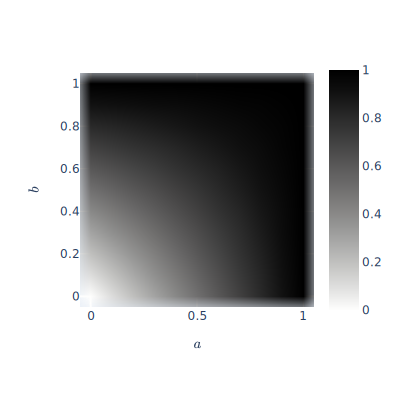     	    |
| [fuzzylite.norm.BoundedDifference][]          	 | [fuzzylite.norm.BoundedSum][]                	 |
| 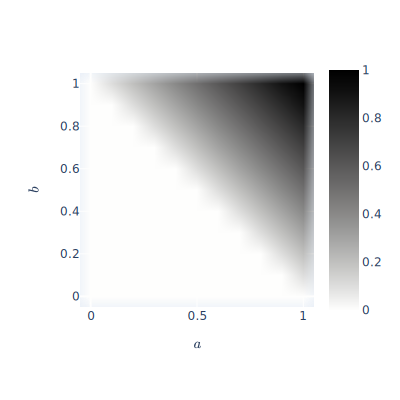 	    | 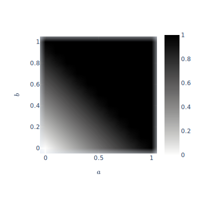       	    |
| [fuzzylite.norm.DrasticProduct][]             	 | [fuzzylite.norm.DrasticSum][]                	 |
| 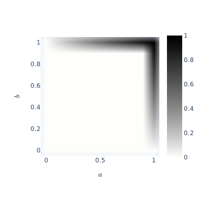    	    | 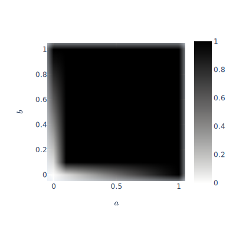       	    |
| [fuzzylite.norm.EinsteinProduct][]            	 | [fuzzylite.norm.EinsteinSum][]               	 |
| 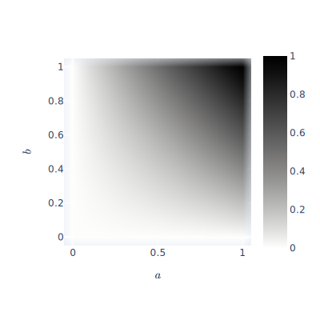   	    |       	    |
| [fuzzylite.norm.HamacherProduct][]            	 | [fuzzylite.norm.HamacherSum][]               	 |
|    	    |       	    |
| [fuzzylite.norm.Minimum][]                    	 | [fuzzylite.norm.Maximum][]                   	 |
| 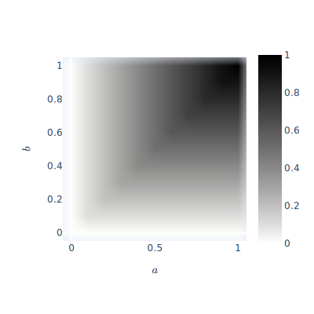           	    | 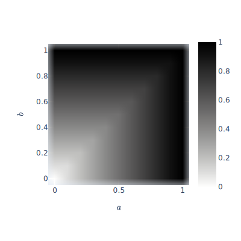          	    |
| [fuzzylite.norm.NilpotentMinimum][]           	 | [fuzzylite.norm.NilpotentMaximum][]          	 |
| 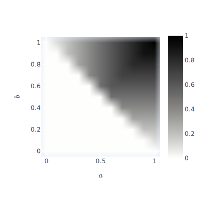  	    | 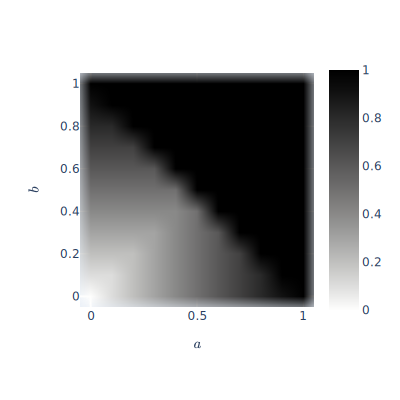 	    |
| 	                                               | [fuzzylite.norm.NormalizedSum][]             	 |
| 	                                               |     	    |
| 	                                               | [fuzzylite.norm.UnboundedSum][]              	 |
| 	                                               | 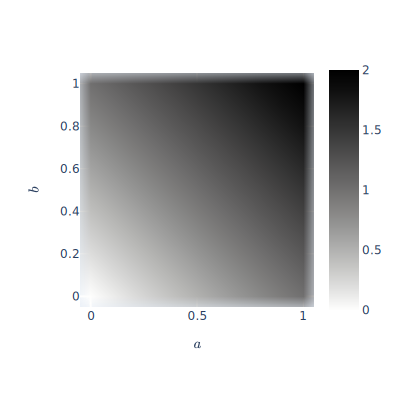     	    |
