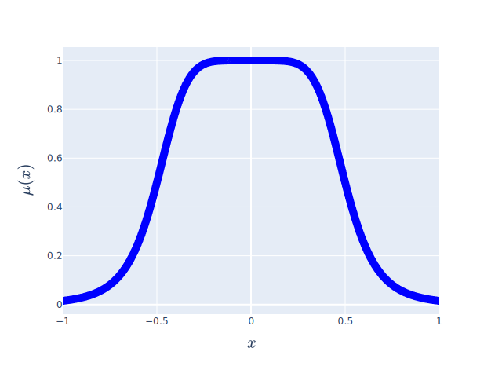
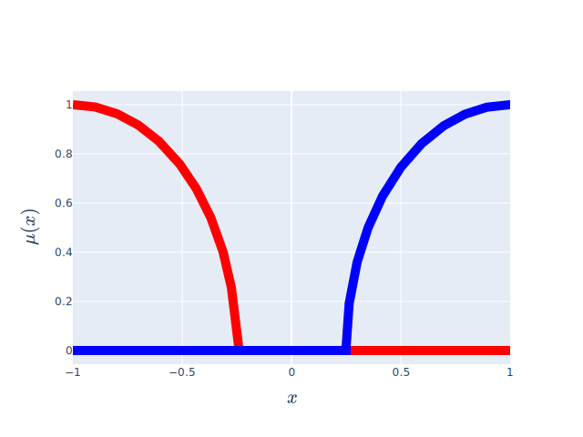
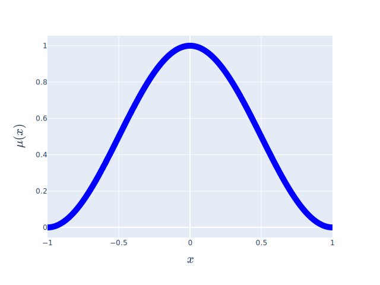
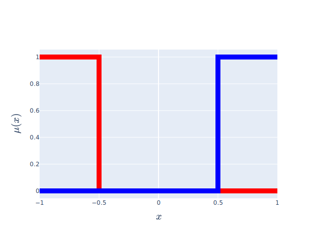
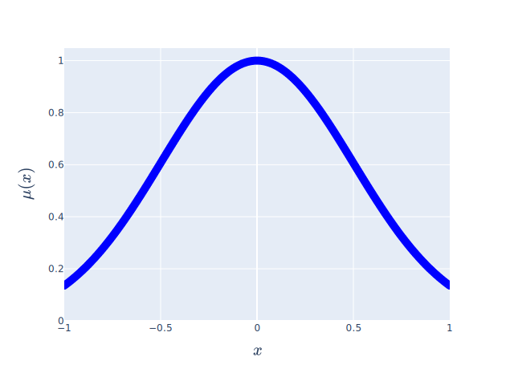
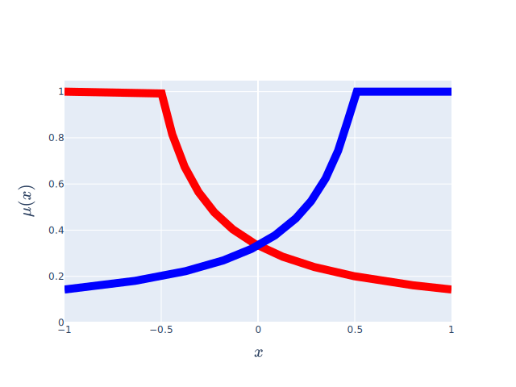
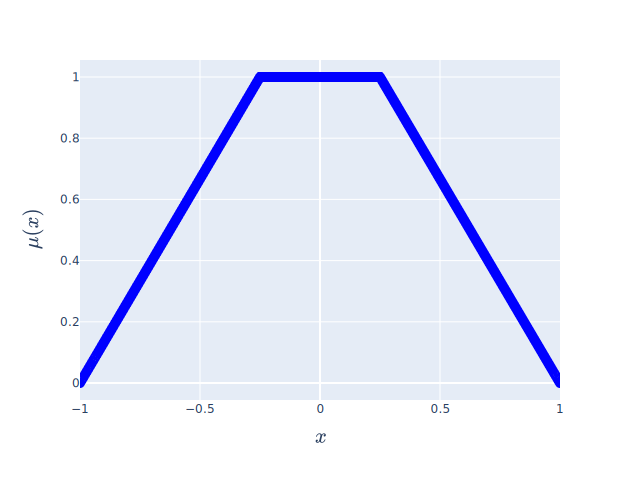
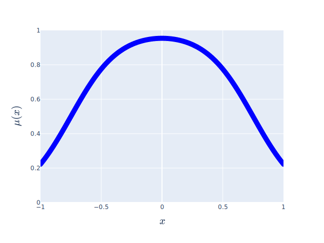
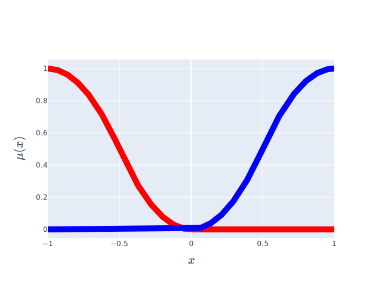
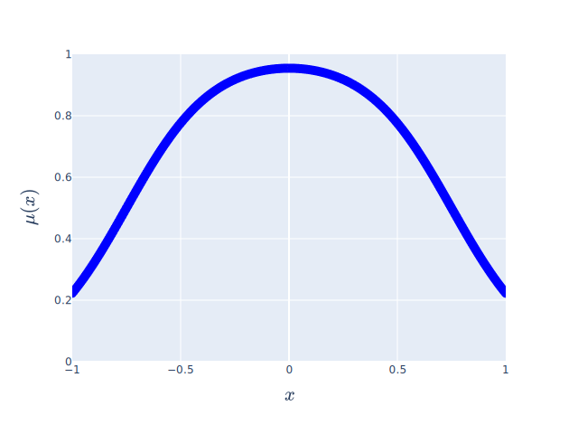

# Terms

The linguistic terms in this library can be divided into four groups, namely `basic`, `extended`, `edge`, and
`function`.

| `basic/function`                       	 | `extended`                                  	 | `edge`                                               	  |
|------------------------------------------|-----------------------------------------------|---------------------------------------------------------|
| [fuzzylite.term.Discrete][]            	 | [fuzzylite.term.Bell][]                     	 | [fuzzylite.term.Arc][]                               	  |
|     	    |               	    |                         	     |
| [fuzzylite.term.Rectangle][]           	 | [fuzzylite.term.Cosine][]                   	 | [fuzzylite.term.Binary][]                            	  |
|     	    |             	    |                      	     |
| [fuzzylite.term.SemiEllipse][]         	 | [fuzzylite.term.Gaussian][]                 	 | [fuzzylite.term.Concave][]                           	  |
|  	    |           	    |                     	     |
| [fuzzylite.term.Triangle][]            	 | [fuzzylite.term.GaussianProduct][]          	 | [fuzzylite.term.Ramp][]                              	  |
|     	    |    	    |                        	     |
| [fuzzylite.term.Trapezoid][]           	 | [fuzzylite.term.PiShape][]                  	 | [fuzzylite.term.Sigmoid][]                           	  |
|     	    |            	    |                     	     |
| [fuzzylite.term.Constant][]            	 | [fuzzylite.term.SigmoidDifference][]        	 | [fuzzylite.term.SShape][]	- [fuzzylite.term.ZShape][] 	 |
|      	    |  	    |             	     |
| [fuzzylite.term.Linear][]              	 | [fuzzylite.term.SigmoidProduct][]           	 | [fuzzylite.term.SShape][]                            	  |
|        	    |     	    |                      	     |
| [fuzzylite.term.Function][]            	 | [fuzzylite.term.Spike][]                    	 | [fuzzylite.term.ZShape][]                            	  |
|      	    |              	    |                      	     |
| 	                                        | 	                                             | 	                                                       |

